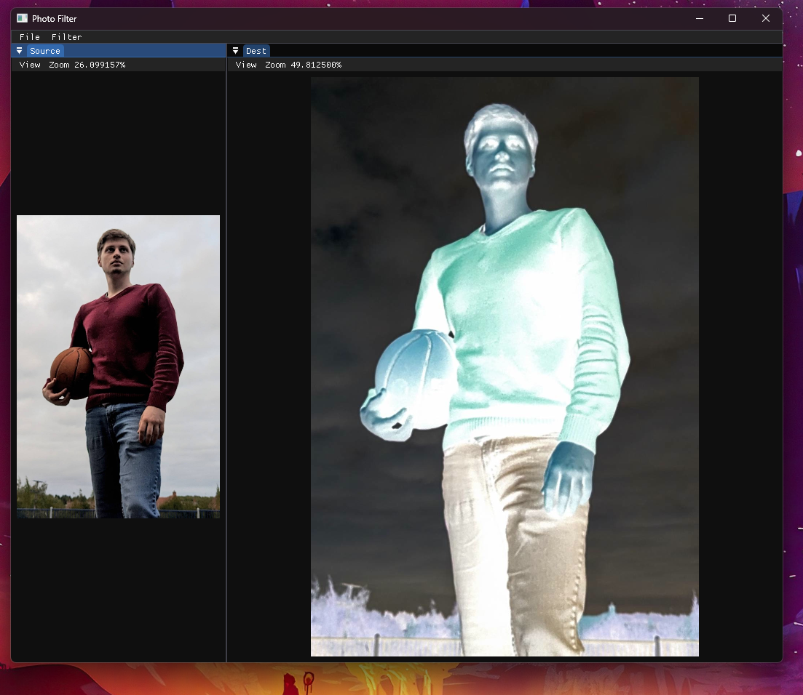

# Photo Filter

A simple program to get me used to c++ again

the goal here is to open an image file and apply various filters.

# Features

## Implemented

- Image loading
- Filter Menu
- Image zooming in preview

## Not Implemented

- Simple blur
- Gaussian blur
- Dithering
- Brightness
- Contrast
- Sharpening

# Project setup

## Submodules
This project uses submodules so be sure to clone using `--recurse-submodules` or run `git submodule init` and `git submodule update`

## Toolchain
I am developing this is VS 2022 and that is all I will support due to basic nature of this project.

## Dependencies
- The main graphical API used for this is [SDL](https://wiki.libsdl.org/SDL3) and it is included as a submodule so make sure you set those up for this to work.
- [SDL_Image](https://wiki.libsdl.org/SDL2_image/FrontPage) to load the images from disk
- [nativefiledialog](https://github.com/mlabbe/nativefiledialog/tree/master) for the file dialog
- [Dear ImGui](https://github.com/ocornut/imgui/tree/master) to deal with the GUI legwork